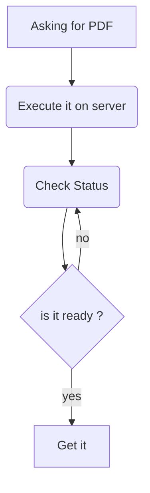

# Jasper Client
## build informations

## Generate PDF using Jasper client

## Contributing
Please contribute using GitHub Flow. Create a branch, add commits, and open a pull request.

Please read CONTRIBUTING for details on our CODE OF CONDUCT, and the process for submitting pull requests to us.

## Copyright and License